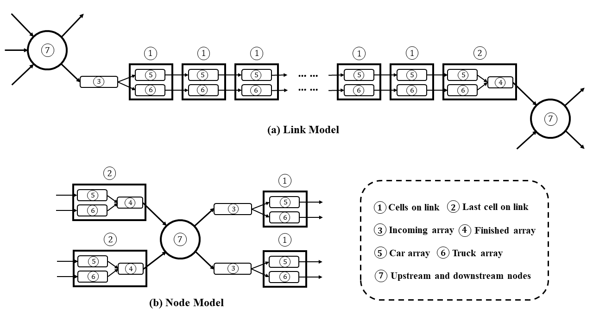

Extensions
===========

In Extensions we introduce more advanced functions build on the *Components*, *Algorithms* and *Models* introduced above. 

*Note functions here are still under developing*. 

Dynamic Network Loading with Multiclass Vehicles
-------------------------------------------------

In traditional dynamic network loading process and traffic flow models, it is often assumed homogeneous traffic. However, in modern multi-modal trasportation system, interactions among different vehicle classes are not neglectable. Here we provide an implementation of the link model with heterogeneous traffic flow proposed in the following paper. Also we implemented a node model together to form the framework of dynamic network loading with multiclass vehicles.

.. note::

  `Modeling heterogeneous traffic flow <https://www.sciencedirect.com/science/article/pii/S0191261517300565>`_

The link and node with multiclass vehicles (e.g. private cars and trucks) are modeled as follows:

For every time doing the evolution of link and node flow, the following steps are performed orderly:

* Links:

	#. Clear the **(3) Incoming array**, which contains all vehicles from upstream links. Private cars should be added to the end of **(5) Car array** in the first cell, trucks to the end of **(6) Truck array** in the first cell. Update the volume of the first cell.
	#. Calculate the flux of each vehicle class among cells, which is decided by the *perceived density* and *fraction of space* of each class in the upstream and downstream cells. For details refer to the paper *Modeling heterogeneous traffic flow* above.
	#. Move the private cars and trucks in **(1) Cells** cell by cell to the **(2) Last cell** according to FIFO rule for each class separately. 
	#. Move vehicles from **(5) Car array** and **(6) Truck array** in the **(2) Last cell** to **(4) Finished array**, according a stochastic scheme, with probability **p** to move a car and **1-p** to move a truck. **p** is the proportion of private car over all vehicles in **(5) Car array** and **(6) Truck array** in the **(2) Last cell**.
	#. Update the volume, perceived density of each vehicle class, and fraction of space of each vehicle class for every cell. Note for the **(2) Last cell**, vehicles in **(4) Finished array** are also counted as in the last cell.

* Nodes:

	#. Calculated demand of each upstream link to every downstream link. Basically count the number of vehicles in **(4) Finished array** of each upstream link. (Q: should we covert 1 truck to (1+c)*car?)
	#. Calculated supply of each downstream link, which is decided by the volume of vehicles in the first cell of each downstream link.
	#. Using the *uncontrolled junction* model to compute the flux from each upstream link to each downstream link.
	#. Move vehicles from **(4) Finished array** of each upstream link to **(3) Incoming array** of each downstream link.

Note on links the private cars and trucks are FIFO separately but not FIFO aggregately. At nodes the traffic is generally not FIFO.

.. toctree::
   :maxdepth: 1

* `Home <index.html>`_
* :ref:`genindex`
* :ref:`search`